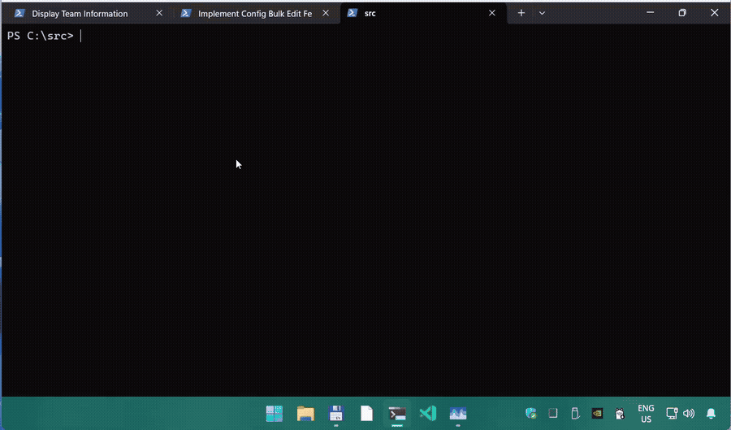

# ElBruno.PresenterTimer

[](https://www.nuget.org/packages/ElBruno.PresenterTimer)
[](https://www.nuget.org/packages/ElBruno.PresenterTimer)
[](https://github.com/elbruno/ElBruno.PresenterTimer/actions/workflows/dotnet-tool-publish.yml)
[](LICENSE)
[](https://dotnet.microsoft.com/)
[](https://github.com/elbruno/ElBruno.PresenterTimer)
[](https://twitter.com/elbruno)



**ElBruno.PresenterTimer** is a Windows desktop application (Session Timeline Overlay) for presenters, content creators, trainers, and speakers who need to stay on track during recordings, demos, conferences, or workshops — without constantly switching windows or checking a separate clock.

The app runs in the Windows system tray and displays a subtle, always-on-top overlay that shows your full session plan divided into sections. As time passes, the current section is highlighted, completed sections are visually differentiated, and configurable alerts fire when a section is almost over or the session goes into overtime.

Choose between two overlay modes:
- **Full Timeline** — horizontal bar showing all sections at a glance
- **Mini Window** — compact window showing current section name, remaining times, and progress (resizable, transparent)

**Built with:** .NET 10 · WPF · MVVM · System Tray Integration · JSON-driven session plans · Settings persistence to `%AppData%`

## What's New

- ✨ **v0.2.0 — Mini Window Overlay** — New compact overlay mode as alternative to full timeline bar
  - Resizable, transparent window with section name and remaining times
  - Live overlay mode switching in settings (no app restart needed)
  - Position persistence and responsive layout
- 🎯 **v0.1.0** — MVP release with full timeline overlay, session management, and alert system

## Features

- **System tray app** — minimal footprint; lives in the Windows notification area with color-coded state icon.
- **Always-on-top overlays** — two display modes to choose from:
  - **Full Timeline** — horizontal bar showing all sections at a glance (original mode)
  - **Mini Window** — compact resizable window showing current section, remaining times, and progress bar
- **Live mode switching** — change overlay mode in Settings without restarting the session.
- **JSON-driven session plans** — define your session title, sections, durations, notes, colors, and warning thresholds in a simple JSON file.
- **Live section tracking** — current section is highlighted; progress displayed across the full session.
- **Visual state indicators** — tray icon color reflects app state: Gray (no session), Blue (loaded), Green (running), Yellow (warning), Red (overtime).
- **Timer controls** — start, pause, resume, reset, next/previous section, restart current section, and extend by ±1 or ±5 minutes.
- **Configurable alerts** — section warning, section end, session end, and overtime alerts with optional audio and Windows notifications.
- **Session preview** — review the full plan before starting.
- **In-app Session Plan Editor** — create and edit session title, metadata, and sections (duration, notes, color, warning) with live validation and JSON save/open.
- **Session summary** — post-session recap with planned vs. actual times per section; export to clipboard, Markdown, or JSON.
- **Recent sessions** — quick reload of up to 10 previously used session files.
- **Settings persistence** — all preferences saved to `%AppData%\ElBruno.PresenterTimer\settings.json` (theme, colors, opacity, overlay position, alert behavior, hotkey enablement).
- **Settings UI** — dedicated window to configure overlay appearance, alert behavior, auto-advance, and more.

---

## Prerequisites

| Requirement | Version |
|---|---|
| Windows | 10 or later (64-bit) |
| .NET SDK | 10.0 or later |
| IDE (optional) | Visual Studio 2022 / Rider / VS Code + C# Dev Kit |

---

## Build & Run

### Clone the repository

```bash
git clone https://github.com/elbruno/ElBruno.PresenterTimer.git
cd ElBruno.PresenterTimer
```

### Build

```bash
dotnet build ElBruno.PresenterTimer.sln
```

### Run the app

```bash
dotnet run --project src\ElBruno.PresenterTimer
```

The application will launch in the Windows system tray.

### Run tests (250+ tests)

```bash
dotnet test ElBruno.PresenterTimer.sln
```

---

## Install as .NET Tool (Windows)

Install globally from NuGet:

```bash
dotnet tool install --global ElBruno.PresenterTimer
```

Run the app:

```bash
presentertimer
```

The installed command starts the tray app directly.

To update later:

```bash
dotnet tool update --global ElBruno.PresenterTimer
```

---

## End-User Documentation

Looking for day-to-day usage guidance (install/run, tray/overlay controls, settings, plan editor, troubleshooting)?

- 👉 [User Manual](docs/user-manual.md)

---

## Session JSON Format

### Minimal (MVP) Format

Define your session in a `.json` file:

```json
{
  "title": "My Presentation",
  "description": "Session description (optional)",
  "sections": [
    {
      "title": "Intro",
      "duration": "00:03:00",
      "notes": "Welcome and overview"
    },
    {
      "title": "Demo",
      "duration": "00:15:00",
      "notes": "Live demonstration"
    },
    {
      "title": "Wrap-up",
      "duration": "00:04:00",
      "notes": "Summary and Q&A"
    }
  ]
}
```

### Extended Format (with per-section colors & warnings)

```json
{
  "title": "AI Agents Demo",
  "description": "A structured recording session",
  "sections": [
    {
      "title": "Intro",
      "duration": "00:03:00",
      "notes": "Welcome and context",
      "color": "#4CAF50",
      "warningAt": "00:01:00"
    },
    {
      "title": "Demo",
      "duration": "00:15:00",
      "notes": "Live demo",
      "color": "#9C27B0",
      "warningAt": "00:02:00"
    }
  ]
}
```

### Schema

| Field | Required | Type | Notes |
|---|---:|---|---|
| `title` | Yes | `string` | Session title |
| `description` | No | `string` | Optional description |
| `sections` | Yes | `array` | At least one section required |
| `sections[].title` | Yes | `string` | Section name |
| `sections[].duration` | Yes | `string` | Format: `HH:mm:ss` (e.g., `"00:05:00"`) |
| `sections[].notes` | No | `string` | Presenter notes |
| `sections[].color` | No | `string` | Hex color for section (e.g., `"#4CAF50"`) |
| `sections[].warningAt` | No | `string` | Warning threshold before section ends (e.g., `"00:01:00"`); must be less than section duration |

### Sample Files

Sample session JSON files are included in the `samples/` folder:

- **short-demo.json** — 10-minute demo (Intro, Demo, Wrap-up)
- **demo-mode.json** — ultra-short demo-mode sample (3 sections, 5–8 seconds each)
- **podcast.json** — 30-minute podcast format with 6 sections and extended metadata
- **conference-talk.json** — 45-minute conference talk with live demo and Q&A
- **workshop.json** — 60-minute workshop with theory, exercises, and breaks
- **ai-agents-demo.json** — 27-minute structured recording with colors and per-section warnings
- **invalid-warning-exceeds-duration.json** — intentionally invalid (for testing validation)

Load any sample file by right-clicking the tray icon → **Import Session JSON**.

---

## Usage

### Starting a Session

1. Right-click the tray icon → **Import Session JSON** → select a `.json` file.
2. **Session Preview** window displays the full plan.
3. Click **Start Session** to begin the countdown.
4. The timeline overlay appears automatically (if **Settings → Behavior → Show timeline overlay when session starts** is enabled).

### During a Session

- **Current section** is highlighted in the overlay with elapsed/remaining time.
- **Tray icon color** indicates state:
  - 🟩 **Green** — session running on schedule.
  - 🟨 **Yellow** — warning: section almost complete.
  - 🟥 **Red** — overtime detected.
  - ⏸️ **Paused** — session paused.
- **Overlay displays:** session title, current/next section, current section elapsed/remaining, total session elapsed/remaining, and progress bar.
- **Alerts** may include overlay text, system notifications, and/or audio (configurable in Settings).

### Tray Menu

Right-click the tray icon to access:

```
Session Timeline Overlay

Session >
  Start Session
  Pause / Resume
  Reset Session

Sections >
  Next Section
  Previous Section
  Restart Current Section
  Extend Current Section >
    +1 minute
    +5 minutes

Plan / JSON >
  Import Session JSON
  Reload Last Session
  Recent Sessions (up to 10)
  Export Sample JSON

Overlay >
  Show Timeline Overlay
  Hide Timeline Overlay

Windows / App >
  Open Session Preview
  Open Session Plan Editor
  Open Session Summary

Settings
About
Exit
```

### Session Summary

After a session ends, the **Session Summary** window shows:

- Planned vs. actual duration per section
- Total session planned vs. actual time
- Difference from plan (e.g., +04:20)
- Section-level overtime detection
- Manual extensions applied
- Export options:
  - Copy summary to clipboard (plain text)
  - Save as Markdown (`.md`)
  - Save as JSON (`.json`)

---

## Settings

All settings are stored in `%AppData%\ElBruno.PresenterTimer\settings.json` and can be configured via **Settings** window (access from tray menu).

### General

- Launch app minimized to tray
- Remember last session
- Auto-load last session on startup
- Show session preview after import
- Confirm before reset / exit while session is running

### Behavior

- Show timeline overlay when session starts
- Hide overlay when session ends
- Auto-advance sections (always enabled)
- Keep counting overtime after section/session end
- Enable global hotkeys (for future implementation)
- Enable overlay click-through
- Pause timer when computer locks

### Overlay Style

- Theme (System/Light/Dark)
- Accent color
- Warning color
- Overtime color
- Section opacity levels (completed, upcoming, current)
- Overall overlay opacity
- Font family and size
- Border radius
- Show/hide toggles: section labels, session title, current/next section title, elapsed/remaining times

### Overlay Layout

- **Overlay mode** (Full Timeline or Mini Window)
- Position (top/bottom/left/right, custom)
- Monitor selection
- Width and height settings
- Remember custom position

### Alerts

- Section warning threshold (default: 1 minute)
- Session warning threshold (default: 3 minutes)
- Alert flags: enable section warning, section end, session end, overtime
- Audio alerts (optional; disabled by default)
- Windows notifications (optional; disabled by default)

---

## Project Structure

```
ElBruno.PresenterTimer/
  src/
    ElBruno.PresenterTimer/
      App.xaml / App.xaml.cs        Main WPF application
      Program.cs                    Entry point
      MainWindow.xaml / .xaml.cs    (Removed; tray-only startup)
      Views/
        TimelineOverlayWindow.xaml  Timeline overlay (main UI)
        SessionPreviewWindow.xaml   Pre-session review
        SessionSummaryWindow.xaml   Post-session summary
        SettingsWindow.xaml         Settings UI
      ViewModels/
        ViewModelBase.cs            Base MVVM class (INotifyPropertyChanged)
        TimelineOverlayViewModel.cs  Overlay state and animation logic
        SessionPreviewViewModel.cs   Preview/import flow
        SessionSummaryViewModel.cs   Summary display and export
        SettingsViewModel.cs        Settings form binding
      Services/
        SessionTimerService.cs      Timer, section tracking, state management
        SessionLoaderService.cs     JSON parsing and deserialization
        SessionValidationService.cs Validation rules (PRD §7.4)
        TrayIconService.cs          System tray integration and menu
        AlertService.cs             Alert deduplication and firing logic
        SettingsService.cs          Persistence and default loading
        FileDialogService.cs        File open/save dialogs
        SummaryFormatter.cs         Plain text / Markdown / JSON export
        [Other services...]
      Abstractions/
        ISessionTimerService.cs
        ISessionLoaderService.cs
        ISessionValidationService.cs
        ITrayIconService.cs
        IAlertService.cs
        ISettingsService.cs
        IFileDialogService.cs
      Models/
        SessionPlan.cs              Deserialized session data
        SessionSection.cs           A section within a plan
        AppSettings.cs              All app settings groups
        SessionResult.cs            Post-session summary data
        [Other models...]
      Assets/
        (App icons and resources)
  tests/
    ElBruno.PresenterTimer.Tests/
      SanityTests.cs                Core MVVM infrastructure tests
      LoaderParsingTests.cs         JSON parsing (27 tests)
      ValidationTests.cs            Validation rules (22 tests)
      SessionTimerServiceTests.cs   Timer logic (60 tests)
      AlertServiceTests.cs          Alert behavior (54 tests)
      SettingsServiceTests.cs       Settings persistence (33 tests)
      [Other test files...]
  docs/
    SessionTimelineOverlay_PRD.md   Full product requirements and specifications
  samples/
    *.json                          Sample and test session files
  .squad/
    agents/                         Agent histories (Ripley, Parker, Dallas, Kane, Lambert)
    decisions/                      Decision notes
```

---

## Post-MVP Roadmap

Features deferred beyond MVP (see PRD §13):

- Global hotkeys (framework in place; enablement pending)
- Multi-monitor advanced support (Fallback to primary if saved monitor disconnected)
- OBS-friendly capture window mode
- Visual session editor / templates
- Import/export user settings profiles
- Custom alert sounds
- Advanced overlay animations and display modes

---

## Architecture Notes

- **MVVM pattern:** ViewModels bind to Views via `INotifyPropertyChanged`; all business logic is stateless and testable.
- **Dependency injection:** Abstractions for services; concrete implementations wired in `App.xaml.cs`.
- **Deterministic testing:** Timer tests use minimal-delay assertions (~50–300 ms waits with ±150–200 ms tolerances) to avoid flaky time-based tests.
- **Thread-safe state:** `SessionTimerService` uses locks for timer snapshot reads; `TrayIconService` uses `Interlocked.Exchange` to suppress redundant icon updates.
- **Settings failsafe:** Corrupt `settings.json` falls back to hardcoded defaults without crashing.

---

## License

This project is licensed under the [MIT License](LICENSE).

---

## Publishing (Maintainers)

### Automated Release Process

Packaging, publishing, and GitHub release creation are fully automated via `.github/workflows/publish.yml`:

1. **Tag & Push** — Create and push a git tag:
   ```bash
   git tag -a v0.3.0 -m "Release v0.3.0: {Feature description}"
   git push origin v0.3.0
   ```

2. **Automated Pipeline** — The workflow triggers on tag push and:
   - ✅ Builds and tests the solution (Windows runner)
   - ✅ Packs the NuGet tool package
   - ✅ Publishes to NuGet.org (Ubuntu runner with trusted publisher OIDC)
   - ✅ **Automatically creates a GitHub release** with auto-generated changelog

3. **Results** — Within 2-3 minutes:
   - 📦 Package appears on https://www.nuget.org/packages/ElBruno.PresenterTimer/
   - 📌 Release appears on https://github.com/elbruno/ElBruno.PresenterTimer/releases/
   - 📝 Changelog auto-generated from commit messages since last tag

### Configuration

Before first release, configure NuGet trusted publishing for this GitHub repository:
- Repository Settings → Environments → Create new environment `release`
- Add `NUGET_USER` secret with your NuGet organization name (for OIDC token exchange)

No manual GitHub release creation needed — it's automatic!

---

## Author

Built by **Bruno Capuano** ([@elbruno](https://github.com/elbruno)) — El Bruno.

---

## See Also

- [User Manual](docs/user-manual.md) — End-user guide for installation, controls, settings, and troubleshooting.
- [Product Requirements](docs/SessionTimelineOverlay_PRD.md) — Full specifications, 17 sections, MVP scope, and roadmap.
- [Agent Histories](.squad/agents/) — Development record of each team member's contributions.
