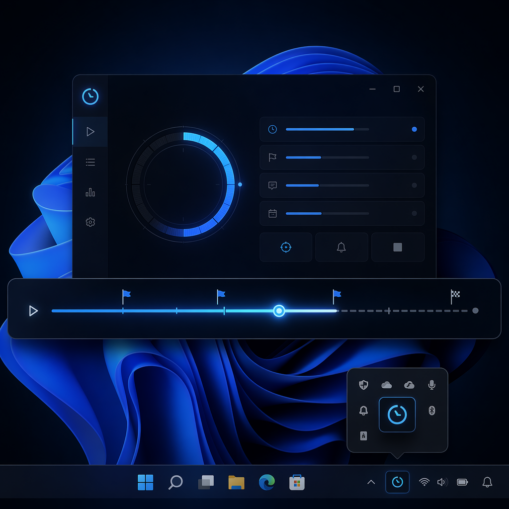
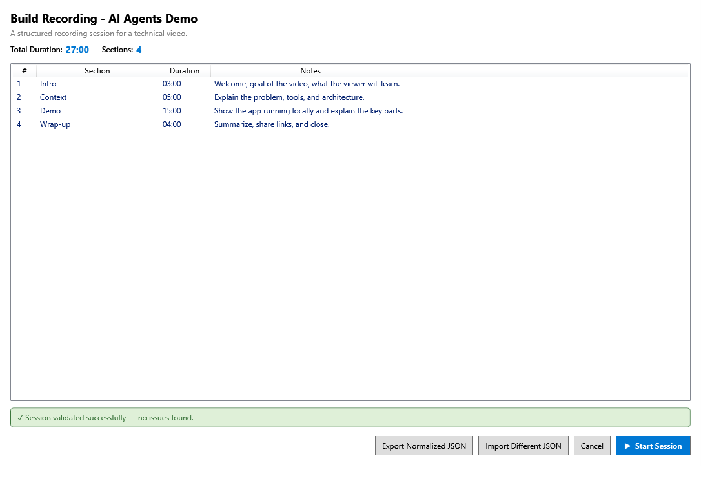
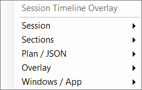
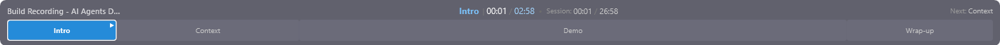
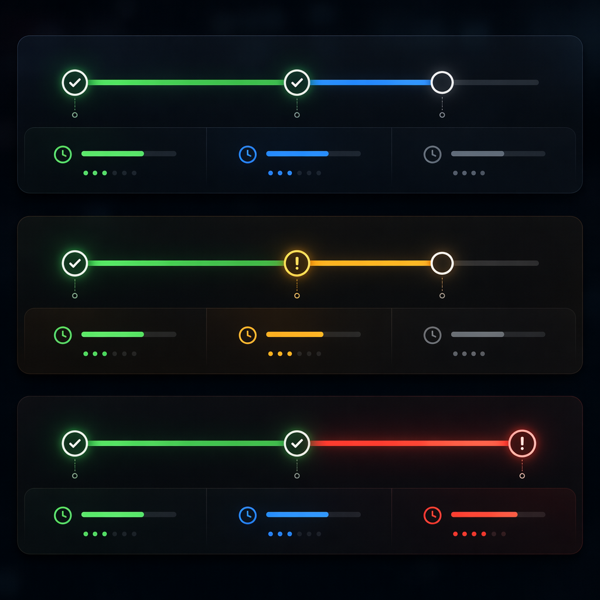
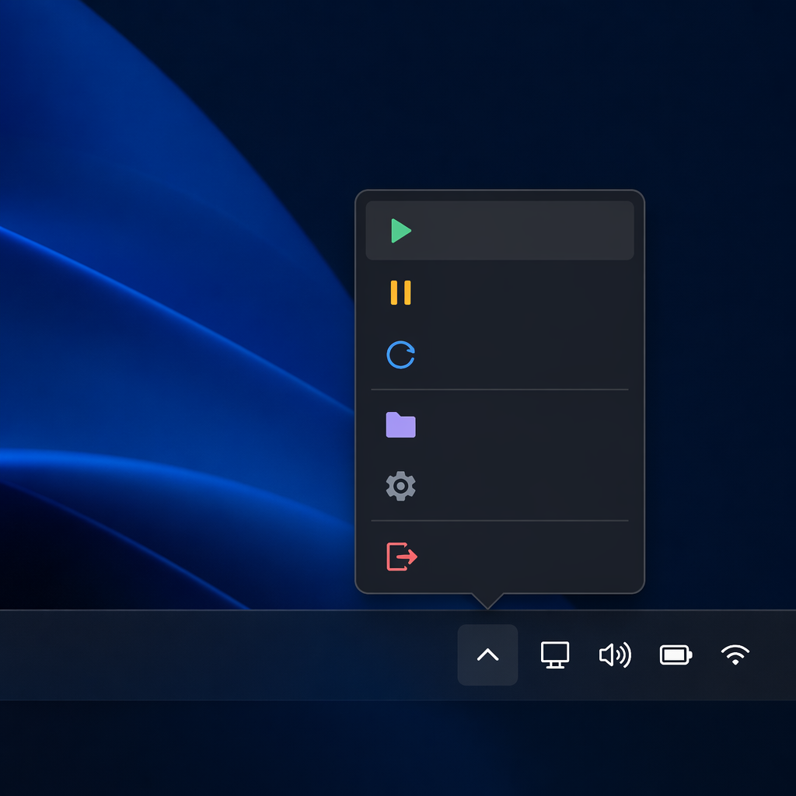
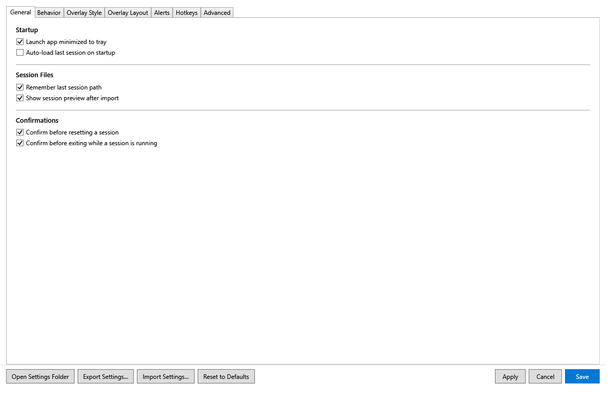
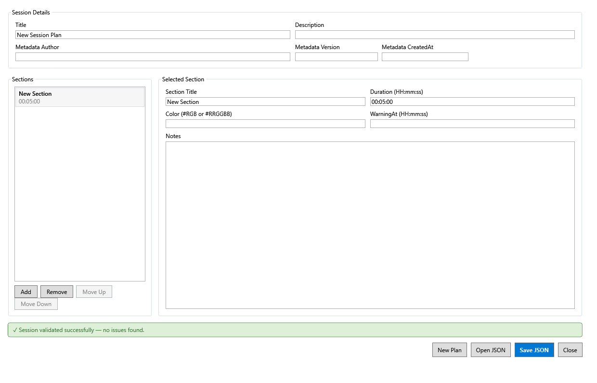

# PresenterTimer User Manual

This guide is for presenters and speakers using **ElBruno.PresenterTimer** in day-to-day sessions.



---

## Install and run

### Option A: Install as a .NET global tool (recommended)

```bash
dotnet tool install --global ElBruno.PresenterTimer
presentertimer
```

To update later:

```bash
dotnet tool update --global ElBruno.PresenterTimer
```

### Option B: Run from source

```bash
dotnet run --project src\ElBruno.PresenterTimer
```

When launched, the app runs from the Windows system tray.

---

## Load a session plan

1. Right-click the tray icon.
2. Select **Import Session JSON**.
3. Pick a `.json` session file (you can start from files in `samples\`).
4. Review the plan in **Session Preview**.
5. Click **Start Session**.



---

## Controls: tray menu and overlay

The tray menu is your main control surface:



- **Session**: Start, Pause/Resume, Reset
- **Sections**: Next, Previous, Restart current, Extend by +1/+5 min
- **Plan / JSON**: Import, Reload last, Recent sessions, Export sample JSON
- **Overlay**: Show/Hide timeline
- **Windows / App**: Preview, Plan Editor, Summary, Settings, About, Exit

Timeline overlay at runtime:



Visual cues:
- Green: running on schedule
- Yellow: warning threshold reached
- Red: overtime




---

## Settings

Open **Settings** from the tray menu.



Key areas:
- **General**: startup behavior, last-session options, confirmations
- **Behavior**: auto show/hide overlay, auto-advance, click-through
- **Overlay Style**: theme, colors, fonts, opacity
- **Overlay Layout**: monitor selection, size, position, custom placement
- **Alerts**: section/session warning thresholds, audio and notifications

### Monitor selection

Use **Settings → Overlay Layout → Monitor selection** to choose which display shows the overlay.  
If your setup changes (dock/undock), reopen Settings and re-select the active monitor.

### Transparency (opacity)

Use **Settings → Overlay Style → Overall overlay opacity** to set transparency.  
Lower values make the overlay less intrusive during recording or live demos.

---

## Session Plan Editor

Open **Session Plan Editor** from the tray menu to create or edit plans without manually editing JSON.



Typical workflow:
1. Enter session title and optional description.
2. Add sections with title, duration (`HH:mm:ss`), notes, color, and warning threshold.
3. Validate and save to `.json`.
4. Import the saved file and start the session.

---

## Troubleshooting

### The app is running but no main window appears
This is expected. PresenterTimer is tray-first; use the notification area icon.

### I cannot see the overlay
- In tray menu, choose **Overlay → Show Timeline Overlay**.
- Check **Settings → Overlay Layout → Monitor selection**.
- Increase overlay opacity in **Overlay Style**.
- Disable click-through temporarily if you need to interact with it.

### Session file does not load
- Confirm valid JSON syntax.
- Confirm `duration` values use `HH:mm:ss`.
- Confirm `warningAt` is smaller than section `duration`.
- Test with a known-good file in `samples\`.

### Alerts are not noticeable
- Enable desired alert types in **Settings → Alerts**.
- Enable audio and/or Windows notifications.
- Verify warning thresholds are not too short.

---

## Tool usage notes (end users)

- If you installed as a global tool, use `presentertimer` to launch quickly from terminal/Run dialog.
- Use `dotnet tool update --global ElBruno.PresenterTimer` to stay current.
- Session plans are plain JSON files, so you can version them in your own repositories.

---

## Related docs

- [README](../README.md) — project overview, build, and developer details.
- [Sample session plans](../samples/README.md) — ready-to-use JSON examples.
- [Product Requirements](./SessionTimelineOverlay_PRD.md) — full product specification.
